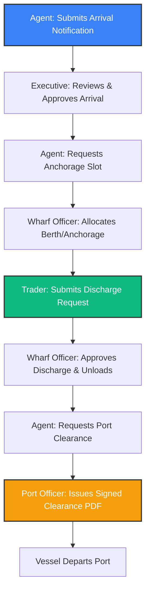

# 🎓 Manarah Port Management System — Discussant Question & Answer Guide
## دليل أسئلة المناقشة وأجوبتها لـ "نظام إدارة ميناء منارة"

This document serves as an exhaustive, technical, and domain-specific guide to prepare you for your project defense. The questions are categorized into six key areas, with detailed professional answers provided in both **English** and **Arabic** to help you communicate effectively during the exam.

---

## 📑 Table of Contents (جدول المحتويات)
1. [System Architecture & Technologies (هندسة النظام والتقنيات المستخدمة)](#1-system-architecture--technologies)
2. [Security & Authentication (الحماية والمصادقة)](#2-security--authentication)
3. [Database & Data Integrity (قاعدة البيانات وسلامة البيانات)](#3-database--data-integrity)
4. [Port Business Logic & Operational Workflows (منطق العمل والتدفقات التشغيلية للميناء)](#4-port-business-logic--operational-workflows)
5. [Localization (Arabic/English) & UI/UX Design (التعريب والتصميم وتجربة المستخدم)](#5-localization-arabicenglish--uiux-design)
6. [Performance, Scalability & Future Work (الأداء، القابلية للتوسع والعمل المستقبلي)](#6-performance-scalability--future-work)

---

## 1. System Architecture & Technologies
### هندسة النظام والتقنيات المستخدمة

#### Q1: Why did you choose Laravel for the backend and React for the frontend instead of a monolithic model (like Laravel Blade)?
* **Underlying Intent:** The examiner wants to verify your understanding of modern web architectures, API-first development, and separation of concerns.
* **Suggested Answer:**
  * **English:** We chose a decoupled, single-page application (SPA) architecture because of **scalability, performance, and cross-platform capability**. React provides a fast, dynamic, and native-feeling user interface using virtual DOM, which is essential for a port system that requires real-time interactions across multiple user dashboards. Laravel was selected as an API-first backend because of its robust ecosystem, security defaults, fast routing, and clean Eloquent ORM. This separation ensures that the frontend can be compiled and served globally (via CDNs like Vercel) while the Laravel API handles database transactions securely, making it easy to build mobile apps in the future using the same backend.
  * **Arabic:** اخترنا معمارية مستقلة (Decoupled SPA) لفصل الواجهات (React) عن الخلفية (Laravel) لتحقيق **سهولة التوسع، والأداء العالي، وإمكانية التوافق مع منصات متعددة**. توفر React واجهة مستخدم سريعة وديناميكية تعطي شعور التطبيق السحابي الأصيل، وهو أمر ضروري لنظام الميناء الذي يتطلب تفاعلات فورية عبر لوحات تحكم متعددة للمستخدمين. وتم اختيار Laravel كباك إند مبني على واجهات البرمجية (API-First) بسبب بنيتها القوية، وأنظمتها الأمنية الافتراضية، ومحرك Eloquent ORM لتبسيط التعامل مع قاعدة البيانات. هذا الفصل يتيح لنا إمكانية تطوير تطبيقات للهواتف الذكية مستقبلاً بالاعتماد على نفس الـ API دون الحاجة لإعادة كتابة منطق العمل.

#### Q2: How is the state managed between the frontend and the backend? Are you using REST APIs?
* **Underlying Intent:** To assess your knowledge of API paradigms, HTTP requests, and frontend state synchronization.
* **Suggested Answer:**
  * **English:** Yes, the project communicates strictly via a secure **RESTful API** layer. The frontend sends HTTP requests (GET, POST, PUT, PATCH, DELETE) using `axios` or standard `fetch` methods, and the backend responds with standardized JSON payloads containing HTTP status codes. On the React frontend, we manage state using React Context (for authentication and preferences) and local state hooks (`useState`, `useEffect`) for page-specific data. To secure the routes, requests are authenticated with a Bearer token in the Authorization headers using Laravel Sanctum.
  * **Arabic:** نعم، يتواصل النظام بدقة عبر طبقة **RESTful API** آمنة. يرسل الفرونت إند طلبات HTTP (GET, POST, PUT, PATCH, DELETE) وتستجيب الخلفية ببيانات JSON موحدة تحتوي على رموز حالة الـ HTTP المناسبة. في جانب React، نتحكم بالحالة العامة للنظام باستخدام React Context (مثل مصادقة المستخدم وتفضيلاته) والحالات المحلية (`useState`, `useEffect`) لعرض بيانات الصفحات. ولتأمين المسارات، نضمن رمز Bearer Token في ترويسة الطلبات (Authorization Header) للتحقق من هوية المستخدم باستخدام حزمة Laravel Sanctum.

#### Q3: What is the purpose of Spatie Laravel-Permission in this system, and how is it integrated with Laravel Sanctum?
* **Underlying Intent:** The examiner is checking your understanding of Role-Based Access Control (RBAC) and how it integrates with API token generation.
* **Suggested Answer:**
  * **English:** We implemented **Role-Based Access Control (RBAC)** to ensure strict segregation of duties between Port Officers, Wharf Officers, Maritime Agents, Traders, and Executives. The Spatie package allows us to associate roles and granular permissions directly with `User` models in the database. In the API routes (`routes/api.php`), we use custom middleware (`role:agent`, `role:executive`, etc.) to intercept requests. If a user attempts to call an API endpoint outside their authorized role, the middleware rejects the request and returns a `403 Forbidden` response. Sanctum authenticates *who* the user is, while Spatie checks *what* they are allowed to do.
  * **Arabic:** قمنا بتطبيق نظام **التحكم بالوصول القائم على الأدوار (RBAC)** لضمان الفصل التام للمسؤوليات بين موظفي الميناء، موظفي الأرصفة، الوكلاء الملاحيين، التجار، والإدارة التنفيذية. تتيح لنا حزمة Spatie ربط الأدوار والصلاحيات الدقيقة بجداول المستخدمين في قاعدة البيانات. وفي مسارات الـ API (`routes/api.php`)، نستخدم وسيطًا مخصصًا (Middleware) مثل (`role:agent`, `role:executive`) لاعتراض الطلبات. إذا حاول مستخدم استدعاء واجهة خارج دوره المصرح له، يقوم الوسيط برفض الطلب وإرجاع رمز الخطأ `403 Forbidden`. حزمة Sanctum تتحقق من *هوية* المستخدم، بينما تتحقق Spatie من *صلاحياته*.

#### Q4: How is Laravel's dependency injection container used in this codebase to write clean code?
* **Underlying Intent:** Testing advanced Laravel knowledge regarding Object-Oriented Programming (OOP) and software design patterns.
* **Suggested Answer:**
  * **English:** Laravel’s Service Container is utilized to automatically inject dependencies into our controller methods. When a controller requires a specific Request class or service model, Laravel automatically instantiates and injects it. This keeps our controllers clean, adheres to the Single Responsibility Principle, and makes testing easier because dependencies can be mocked during testing phases.
  * **Arabic:** يتم استخدام حاوية خدمات لارافيل (Service Container) لحقن التبعيات (Dependency Injection) تلقائيًا في دوال التحكم (Controllers). عندما يحتاج المتحكم إلى فئة طلب (Request) معينة أو نموذج خدمة، يقوم لارافيل بإنشائها وحقنها تلقائيًا. هذا يحافظ على نظافة الكود ويلتزم بمبدأ المسؤولية الفردية (Single Responsibility Principle) ويسهل كتابة الاختبارات البرمجية.

---

## 2. Security & Authentication
### الحماية والمصادقة

#### Q5: How do you prevent SQL Injection and Cross-Site Scripting (XSS) in your APIs?
* **Underlying Intent:** To ensure you are building secure applications and understand basic security threats.
* **Suggested Answer:**
  * **English:** 
    1. **SQL Injection Prevention:** We use Laravel's **Eloquent ORM** and query builder which utilize PDO parameter binding. Since variables are treated as parameters rather than executable SQL statements, SQL injection is mathematically impossible.
    2. **XSS Prevention:** In our APIs, we strictly sanitize and validate inputs using Laravel's Form Requests before writing to the database. On the frontend, React automatically escapes variables rendered in the JSX curly braces `{}` to prevent malicious scripts from executing in the browser.
  * **Arabic:** 
    1. **منع حقن SQL:** نعتمد بالكامل على **Eloquent ORM** وباني الاستعلامات (Query Builder) في لارافيل، واللذان يستخدمان آلية PDO لربط المعاملات (Parameter Binding). نظرًا لمعاملة المتغيرات كقيم وليس كتعليمات SQL قابلة للتنفيذ، فإن هجمات حقن SQL مستحيلة الحدوث.
    2. **منع XSS:** في جانب الـ API، نقوم بالتحقق الصارم وتطهير البيانات المدخلة باستخدام قواعد التحقق (Form Requests) في لارافيل قبل تخزينها. وفي جانب الفرونت إند، تقوم React تلقائيًا بتطهير وترشيح القيم المعروضة داخل الأقواس المتعرجة `{}` لمنع تنفيذ أي كود خبيث في متصفح المستخدم.

#### Q6: Explain the user registration and approval process. How do you prevent unauthorized registration of high-privilege roles like Port Officers or Wharf Officers?
* **Underlying Intent:** To evaluate the integrity of your security workflow for onboarding users.
* **Suggested Answer:**
  * **English:** High-privilege roles (Port Officers, Wharf Officers, and Executives) **cannot register publicly**. They are created directly by system administrators through the `/admin/users` management portal. Public registration is open only to **Maritime Agents** and **Traders**. However, upon registration, their accounts are automatically placed in a `pending` status (`verified = false`) and they cannot access the system. An Executive must log into their admin dashboard, inspect the user's details and digital signature, and explicitly approve the request (`/executive/users/{id}/approve`) to activate their account.
  * **Arabic:** الأدوار ذات الصلاحيات العالية (مثل موظفي الميناء والأرصفة والإدارة التنفيذية) **لا يمكنهم التسجيل علنًا**. يتم إنشاؤهم مباشرة من قبل مسؤولي النظام عبر لوحة إدارة المستخدمين (`/admin/users`). التسجيل العام مفتوح فقط **للوكلاء الملاحيين والتجار**. ومع ذلك، عند التسجيل، يتم وضع حساباتهم تلقائيًا في حالة "معلق" (`pending`) ولا يمكنهم تسجيل الدخول إلى النظام. يجب على المدير التنفيذي فحص تفاصيل المستخدم وتوقيعه الرقمي، والموافقة صراحة على الطلب لتنشيط الحساب وسك رمز الدخول.

#### Q7: Why is a digital signature required during registration, and how is it securely handled and verified?
* **Underlying Intent:** Understanding business integrity and operational accountability in port clearance and manifests.
* **Suggested Answer:**
  * **English:** In port operations, maritime agents submit official legal declarations such as Anchorage Requests and Port Clearances. A digital signature provides **non-repudiation**—guaranteeing that the agent cannot deny submitting a specific document. During registration or profile update, the signature is captured via an interactive canvas, transmitted as a secure `base64` image, validated as a valid image format (PNG/JPG) by `AuthController.php`, stored in private Laravel Storage, and linked to the user's record. This signature is dynamically rendered on approved PDF clearance documents for legal compliance.
  * **Arabic:** في عمليات الموانئ، يقدم الوكلاء الملاحيون إقرارات قانونية رسمية مثل طلبات الرسو وتصاريح مغادرة الميناء. يوفر التوقيع الرقمي ميزة **عدم الإنكار (Non-repudiation)**، مما يضمن قانونياً عدم قدرة الوكيل على إنكار تقديم مستند معين. أثناء التسجيل، يتم التقاط التوقيع عبر لوحة تفاعلية، ويتم إرساله كصورة مشفرة بصيغة `base64` ويتم التحقق من صحته وتخزينه في مساحة التخزين الخاصة بلارافيل وتثبيته في سجل المستخدم لطباعته ديناميكياً على تصاريح الـ PDF.

#### Q8: How are passwords secured in the database? What hashing algorithm is used?
* **Underlying Intent:** Checking if you store plaintext passwords or use obsolete hashing (like MD5).
* **Suggested Answer:**
  * **English:** Passwords are never stored as plain text. We use Laravel's default cryptographic hashing system, which utilizes the **Bcrypt** hashing algorithm via the `Hash::make()` utility. Bcrypt is a slow-hashing algorithm that includes a salt to protect against brute-force and rainbow table attacks.
  * **Arabic:** لا يتم تخزين كلمات المرور كنص صريح أبدًا. نستخدم نظام التشفير الافتراضي في لارافيل والذي يعتمد على خوارزمية **Bcrypt** القوية عبر استدعاء فئة `Hash::make()`. تعتبر خوارزمية Bcrypt خوارزمية بطيئة ومملحة (salted)، مما يحمي قاعدة البيانات بالكامل ضد هجمات القوة الغاشمة (Brute-Force) وجداول قوس قزح (Rainbow Tables).

---

## 3. Database & Data Integrity
### قاعدة البيانات وسلامة البيانات

#### Q9: What database engine did you use, and how did you design the schema to ensure data integrity and avoid orphan records?
* **Underlying Intent:** Assessing your database expertise, use of migrations, and referential integrity constraints.
* **Suggested Answer:**
  * **English:** We used **MySQL** with the **InnoDB storage engine** because it supports ACID-compliant transactions, foreign key constraints, and row-level locking. To ensure referential integrity, we wrote Laravel migrations defining explicit foreign keys with cascading options. For example, a `DischargeRequest` is linked to a `Container` via `container_id` with `onDelete('cascade')` or restricted constraints. This ensures that if parent records are deleted, our database prevents orphan records from breaking system logic. We also created database indexes on frequently searched fields like `imo_number` in vessels, `container_id` in containers, and `email` in users to speed up query execution.
  * **Arabic:** استخدمنا قاعدة بيانات **MySQL** مع محرك التخزين **InnoDB** لدعمه الكامل لمعاملات ACID، والقيود الخارجية (Foreign Keys), وقفل الصفوف. ولضمان سلامة البيانات المرجعية، قمنا بكتابة تهجيرات لارافيل (Migrations) لتعريف المفاتيح الخارجية بوضوح مع خيارات التتالي (Cascading). على سبيل المثال، يرتبط طلب التفريغ بجدول الحاويات عبر حقل `container_id` مع تحديد `onDelete('restrict')` أو `cascade` لمنع حذف حاوية لها طلب نشط. كما قمنا بإنشاء فهارس (Indexes) على الحقول الأكثر بحثاً مثل رقم الـ IMO للسفن ورمز الحاوية والبريد الإلكتروني لتسريع الاستعلامات.

#### Q10: How does the system handle concurrent anchorage requests or wharf allocation to prevent double-booking a single wharf berth?
* **Underlying Intent:** Evaluating your knowledge of concurrency control and database transaction locking.
* **Suggested Answer:**
  * **English:** To prevent race conditions where two operators attempt to assign the same wharf berth to different vessels simultaneously, we implement **Database Transactions** combined with **Pessimistic Locking** (`lockForUpdate()`) in our Laravel controllers (e.g., `WharfController.php`). When a Port Officer or Wharf Officer attempts to assign a vessel to a wharf, Laravel locks the respective row in the `wharves` table during the execution of the transaction. Any concurrent request attempting to modify or book that wharf is forced to wait until the first transaction successfully commits or rolls back, ensuring strict data consistency and zero double-bookings.
  * **Arabic:** لمنع حدوث مشاكل تزامن البيانات (Race Conditions) عندما يحاول موظفان حجز نفس الرصيف لسفينتين في نفس اللحظة، نقوم بتطبيق **معاملات قاعدة البيانات (Database Transactions)** المدمجة مع **القفل المتشائم (Pessimistic Locking - `lockForUpdate`)** في متحكمات لارافيل. عندما يبدأ النظام بحجز رصيف، يتم إقفال سجل الرصيف المعني في جدول `wharves` فورًا، ويتم إجبار أي طلب آخر متزامن على الانتظار حتى تنتهي المعاملة الأولى وتلتزم بالتعديل (Commit) أو تتراجع (Rollback)، مما يضمن عدم تداخل الحجوزات نهائيًا.

#### Q11: Are you using Soft Deletes? Why are soft deletes important in a port management system?
* **Underlying Intent:** Checking if you understand data retention regulations and audit logs in port operations.
* **Suggested Answer:**
  * **English:** Yes, we use Laravel's **`SoftDeletes`** trait for critical models like `User` and `Vessel`. Instead of executing an SQL `DELETE` query which permanently erases the row, soft deleting sets a `deleted_at` timestamp. In a highly regulated environment like Manarah Port, physical deletion of records is forbidden because historical logs must be kept for auditing and security investigations. Soft deletes allow administrators to remove active entities from view while maintaining historical integrity, with the option to restore them later if needed via `/admin/users/{id}/restore`.
  * **Arabic:** نعم، نستخدم خاصية **الحذف الناعم (Soft Deletes)** في لارافيل للملفات الهامة مثل المستخدمين والسفن. بدلاً من تنفيذ أمر مسح فيزيائي يحذف البيانات نهائياً، يقوم الحذف الناعم بتعيين طابع زمني في حقل `deleted_at`. في بيئة خاضعة للتنظيم مثل ميناء منارة، يُحظر الحذف النهائي للسجلات لضرورة الاحتفاظ بالأرشيف لعمليات التدقيق والتحقيقات الأمنية. يسمح الحذف الناعم بإخفاء العناصر النشطة مع الاحتفاظ بسلامة السجلات التاريخية، مع إمكانية استعادتها لاحقاً.

#### Q12: How are large files, such as Cargo Manifest PDFs or Excel sheets, handled, stored, and mapped to the respective Vessel?
* **Underlying Intent:** Testing your knowledge of file storage systems, upload pipelines, and schema associations.
* **Suggested Answer:**
  * **English:** In `ManifestUploadController.php`, uploaded files are validated against allowed mime-types (PDF, XLSX) and limited in size. Once validated, they are stored on the server's local file system or cloud storage (configured via Laravel's `Storage` facade in `storage/app/public`). The system generates a unique hash filename to prevent overwriting existing files, saves the file metadata and path in the `cargo_manifests` table, and links it via a foreign key `vessel_id` or `arrival_notification_id`. The UI can then dynamically render a download link by mapping the relative storage path to a public URL.
  * **Arabic:** في متحكم رفع البيانات (`ManifestUploadController.php`)، يتم التحقق من نوع الملفات المرفوعة (مثل PDF أو Excel) وحجمها الأقصى. بعد التحقق، يتم تخزينها في مساحة التخزين الخاصة بالخادم (عبر واجهة Laravel `Storage` في المجلد العام). يقوم النظام بتوليد اسم فريد ومشفر للملف لمنع تداخل الأسماء، ومن ثم يحفظ رابط المسار وبياناته في جدول `cargo_manifests` ويربطه بمفتاح خارجي بجدول السفينة المعنية، مما يتيح للفرونت إند عرض روابط تحميل ديناميكية وآمنة.

---

## 4. Port Business Logic & Operational Workflows
### منطق العمل والتدفقات التشغيلية للميناء

#### Q13: Describe the complete lifecycle of a vessel in the system, from arrival notification to departure.
* **Underlying Intent:** The discussant wants to see if you actually understand the domain workflow of a port and how different system modules interact sequentially.
* **Suggested Answer:**
  * **English:** The workflow is standard and secure:
    1. **Arrival Notification:** The Maritime Agent submits a vessel arrival notice containing cargo details, IMO number, and the cargo manifest.
    2. **Approval:** The Executive reviews and approves the arrival notice, changing the vessel status from `pending` to `approved_arrival`.
    3. **Berth/Anchorage Assignment:** The agent submits an anchorage request. The Wharf Officer assigns a physical wharf slot (berth) and changes the status to `anchored` or `berthed`.
    4. **Cargo Discharge:** The Trader views their landed containers and submits a discharge request. The Wharf Officer approves the discharge, initiates storage allocation, and updates the container status to `stored`.
    5. **Clearance & Departure:** Once custom dues are cleared, the Agent requests Port Clearance. The Port Officer reviews the logs and issues an official clearance certificate, changing the vessel status to `departed`.
  * **Arabic:** تدفق العمل يسير بخطوات منظمة وقانونية:
    1. **إشعار الوصول:** يقوم الوكيل الملاحي بتقديم طلب إشعار وصول السفينة مع رقم الـ IMO وبيان الشحنة (المانيفست).
    2. **الموافقة التنفيذية:** يراجع المدير التنفيذي الطلب ويوافق عليه، فتتحول حالة السفينة من "معلق" إلى "موافق على الوصول".
    3. **تخصيص الرصيف والرسو:** يطلب الوكيل رسو السفينة، فيقوم موظف الرصيف بتعيين رصيف فيزيائي لها وتتغير حالتها إلى "راسية" (Anchored).
    4. **تفريغ الشحنة:** يرى التاجر حاوياته ويقدم طلب تفريغها، فيوافق موظف الرصيف عليها ويسجل تفريغها وتخزينها في الساحات.
    5. **التصريح والمغادرة:** بعد تصفية الرسوم، يطلب الوكيل "تصريح مغادرة". يراجعه موظف الميناء ويصدر تصريح مغادرة معتمد، لتتغير حالة السفينة إلى "غادرت".

#### Q14: How does the container discharge request and storage assignment logic work?
* **Underlying Intent:** Evaluates your understanding of logistics, warehouse management, and automated matching algorithms.
* **Suggested Answer:**
  * **English:** When a vessel docks, the manifest contains container records linked to a specific Trader’s email. The Trader sees these containers under "My Containers". The Trader then submits a "Discharge Request" for specific containers. In the backend (`WharfController.php`), these requests are batched. The Wharf Officer reviews the batch, checks the storage capacity of the port storage zones (e.g., General, Refrigerated, Hazardous), and allocates storage cells. Once approved, the container state switches to `stored` (assigned storage area), and notifications are dispatched automatically to the Trader's dashboard.
  * **Arabic:** عند رسو السفينة، يحتوي المانيفست على حاويات مسجلة باسم التاجر. يرى التاجر هذه الحاويات في حسابه ويقدم طلب "تفريغ الشحنة" لحاويات معينة. في الباك إند، يتم تجميع هذه الطلبات في مجموعات (Batches). يراجع موظف الرصيف الدفعة، ويتحقق من سعة ساحات التخزين المتوفرة والمناسبة للحاويات (عامة، مبردة، خطرة)، ويخصص لها أماكن التخزين. عند الموافقة، تتحول حالة الحاوية إلى "مخزنة" (Stored) ويتم إرسال إشعار فوري للتاجر.

#### Q15: Explain the anchorage waitlist and timeout mechanism. What happens when an anchorage request times out?
* **Underlying Intent:** Testing advanced system engineering regarding cron jobs, time-delayed actions, or request queuing.
* **Suggested Answer:**
  * **English:** Ports are limited by physical berth spaces. When a Wharf Officer reviews anchorage requests, if all wharves are occupied, they can place a request in the **Waitlist** (`waitlistAnchorageRequest`). The system tracks queue duration. If a berth does not open within a specified operational threshold, a timeout notification is triggered (`triggerTimeoutNotification`). This triggers an alert to the Maritime Agent to reschedule or request emergency clearance, and registers a priority log in the Port Officer's dashboard to optimize scheduling.
  * **Arabic:** الموانئ محدودة بعدد الأرصفة الفيزيائية. عندما يراجع موظف الرصيف طلبات الرسو وتكون جميع الأرصفة مشغولة، يمكنه وضع الطلب في **قائمة الانتظار**. يتتبع النظام مدة الانتظار، وإذا لم يفرغ أي رصيف خلال الوقت المحدد تشغيلياً، يتم إطلاق إشعار انتهاء المهلة (Timeout). يُرسل تنبيه تلقائي للوكيل الملاحي لإعادة جدولة الرحلة أو طلب رسو طارئ، كما يتم تسجيل معاملة ذات أولوية في لوحة موظف الميناء لتسريع الجدولة.

#### Q16: How do you handle emergency exits for vessels? Does it require executive approval or is it a fast-track process?
* **Underlying Intent:** Understanding workflow exceptions, critical operations, and escalation paths in system architecture.
* **Suggested Answer:**
  * **English:** Emergency exits (`executeEmergencyExit`) bypass the normal queue and multi-tier approval workflows due to safety or environmental hazards. An Agent submits an emergency exit request specifying the hazard (e.g., fuel leak, medical emergency). The system routes this request directly to the Port Officer and Executive as a high-priority, blinking red notification. While it is logged instantly, the Port Officer can execute a "fast-track release" which overrides active container discharges, releases the assigned berth, and updates the vessel's log immediately to ensure safety compliance.
  * **Arabic:** خروج الطوارئ يتجاوز قائمة الانتظار العادية وسلسلة الموافقات الطويلة نظراً للمخاطر الأمنية أو البيئية. يقدم الوكيل الملاحي طلب خروج طارئ مع تحديد السبب (تسرب وقود، حالة طبية طارئة). يوجه النظام هذا الطلب فوراً إلى موظف الميناء والإدارة التنفيذية كإشعار أحمر وامض ذو أولوية قصوى. تتيح هذه الميزة لموظف الميناء تفعيل "الإفراج السريع" لتخطي الحظر، وإلغاء حجز الرصيف فوراً لسلامة الميناء.

---

## 5. Localization (Arabic/English) & UI/UX Design
### التعريب والتصميم وتجربة المستخدم

#### Q17: The system fully supports Arabic (RTL) and English (LTR). How did you achieve seamless global language and theme switching without layout breaks?
* **Underlying Intent:** The examiner is testing your modern front-end CSS/HTML design skills, specifically your understanding of RTL layout mechanics, CSS variables, and clean UI engineering.
* **Suggested Answer:**
  * **English:** We built a highly robust, dynamic design system:
    1. **CSS Variables & Tailwind:** We mapped our theme colors and styles to CSS variables in `src/index.css`. Switching themes simply updates the root element's classes (`dark` or `light`).
    2. **RTL / LTR Transitions:** We created a centralized language state. When the language switches to Arabic (`ar`), the application sets the DOM document direction `document.dir = 'rtl'`. We avoided hardcoding pixel values for positioning. Instead, we used logical properties and Tailwind's auto-direction utilities (e.g., using `start` and `end` instead of `left` and `right`). This ensures that sidebars, texts, alignments, and icons swap sides flawlessly without a single layout break.
  * **Arabic:** قمنا ببناء نظام تصميم قوي وديناميكي بالكامل:
    1. **متغيرات CSS ولوحة Tailwind:** قمنا بربط ألوان ومظاهر النظام بمتغيرات CSS في ملف `index.css`. يؤدي تبديل المظهر ببساطة إلى تغيير الفئة النشطة في عنصر الجذور (`dark` أو `light`).
    2. **الانتقال بين RTL و LTR:** أنشأنا حالة لغة مركزية. عند التبديل إلى العربية، يغير التطبيق اتجاه عنصر الـ DOM بالكامل إلى `document.dir = 'rtl'`. تجنبنا استخدام قيم البكسل الثابتة واستخدمنا الخصائص المنطقية وأدوات الاتجاه التلقائي في Tailwind (مثل استخدام `start` و `end` بدلاً من `left` و `right`)، مما يضمن قلب القوائم والخطوط والأيقونات تلقائياً وبسلاسة تامة.

#### Q18: What is "Glassmorphism," and why did you choose it for the user interface of a port system?
* **Underlying Intent:** Assessing your visual design vocabulary, aesthetics, and user experience rationale.
* **Suggested Answer:**
  * **English:** **Glassmorphism** is a modern design trend characterized by semi-transparent, frosted-glass-like panels with subtle borders, backdrop blurs, and vibrant background gradients. We chose this style because it aligns perfectly with a maritime theme. The deep blue gradients represent the sea, while the frosted glass panels provide a clean, modern, high-tech dashboard feel. This aesthetic increases visual hierarchy, reduces eye strain for operators working night shifts, and elevates the software to a premium, production-grade level.
  * **Arabic:** تصميم **Glassmorphism** (تأثير الزجاج البلوري) هو أسلوب تصميم عصري يتميز بعناصر شبه شفافة تشبه الزجاج المغشى مع حدود خفيفة وتأثير غباش الخلفية (backdrop blur) مع تدرجات لونية حية. اخترنا هذا الأسلوب لتناغمه التام مع الهوية البحرية لميناء منارة. تمثل التدرجات الزرقاء الداكنة البحر، بينما تعطي الألواح البلورية انطباعاً تقنياً متطوراً وسهلاً للقراءة. يزيد هذا المظهر من وضوح هرمية البيانات، ويقلل إجهاد العين للموظفين ليلاً.

#### Q19: How are notifications translated dynamically based on the user's preferred language and role in the database?
* **Underlying Intent:** Assessing your architectural foresight in building clean translation pipelines in localized web applications.
* **Suggested Answer:**
  * **English:** Notifications are designed to be dynamic and language-aware. Rather than storing pre-rendered translated HTML blocks in the database, our database `notifications` table stores structured data templates containing metadata (e.g., `type: 'discharge_approved'`, `vessel_name`, `container_id`). When the frontend fetches notifications, the UI component (`NotificationDropdown.tsx` or `TraderNotifications.tsx`) intercepts the payload and passes the metadata keys to our centralized `translations.ts` utility (using the helper functions like `getTranslatedStatus`). This guarantees that if a user changes their interface language from Arabic to English, their entire notification feed instantly re-renders in their chosen language without rewriting database records.
  * **Arabic:** صُممت الإشعارات لتكون مرنة ومتوافقة مع اللغات المختلفة. بدلاً من تخزين جمل نصية مترجمة ثابتة في قاعدة البيانات، يخزن جدول الإشعارات بيانات مهيكلة وقوالب بيانات وصفية (مثل نوع الإشعار واسم السفينة ورقم الحاوية). عندما يستدعي الفرونت إند الإشعارات، تقوم مكونات العرض بتمرير هذه المفاتيح لملف الترجمة المركزي لدينا (`translations.ts`). يضمن هذا أنه في حال قام المستخدم بتغيير لغته من العربية للإنجليزية، فإن كامل سجل الإشعارات لديه سيتحول فوراً للغة الجديدة تلقائياً ودون أي تعديل في قاعدة البيانات.

---

## 6. Performance, Scalability & Future Work
### الأداء، القابلية للتوسع والعمل المستقبلي

#### Q20: What caching strategies could be introduced to speed up dashboard calculations (e.g., container count, pending approvals)?
* **Underlying Intent:** Testing your engineering knowledge regarding backend performance optimization for heavy database reads.
* **Suggested Answer:**
  * **English:** Port dashboards execute aggregate queries (e.g., counting thousands of containers or pending arrivals) which can slow down the system under heavy load. We can introduce **Redis** or Laravel’s built-in **Cache facade** to cache these stats. For instance, when loading the Trader Dashboard, the system will fetch data from cache instead of querying MySQL. We would use database events (Eloquent Observers) to clear and rebuild the cache only when a container status is updated or a new request is submitted. This keeps dashboard reads running in $O(1)$ constant time while preserving live data accuracy.
  * **Arabic:** تنفذ لوحات التحكم استعلامات تجميعية ثقيلة (مثل عد آلاف الحاويات أو الموافقات المعلقة) مما قد يبطئ النظام مع زيادة حجم العمل. يمكننا إدخال نظام **Redis** أو نظام التخزين المؤقت المدمج في لارافيل لـ **الكاش (Cache)**. عند تحميل لوحة التحكم، يستدعي النظام الأرقام من الذاكرة المؤقتة مباشرة بدلاً من إعادة استعلام جداول MySQL. سنستخدم مراقبي النماذج (Eloquent Observers) لتحديث وتفريغ الكاش فقط عند حدوث تغيير حقيقي (مثل تغيير حالة حاوية)، مما يحافظ على سرعة استجابة فائقة للنظام بزمن ثابت $O(1)$.

#### Q21: If Manarah Port experiences a sudden 10x increase in container traffic, how will your application scale to handle the load?
* **Underlying Intent:** The examiner wants to see if you can think beyond a local server and design for cloud-scale enterprise environments.
* **Suggested Answer:**
  * **English:** To handle a 10x increase in traffic, we would implement scaling across three tiers:
    1. **Application Tier:** Deploy the React frontend on global Edge networks (CDNs) and host the Laravel backend in stateless Docker containers orchestrated by **Kubernetes** or Amazon ECS to auto-scale horizontally based on CPU load.
    2. **Database Tier:** Set up database **Read/Write splitting** (routing write operations to a primary MySQL instance and heavy read queries to multiple read-replicas) and implement database sharding based on dates.
    3. **Asynchronous Processing:** Move heavy operations like PDF report generation, Excel manifest parsing, and email alerts to background queues using **Laravel Horizon** and Redis, ensuring the user gets an instant response while the server processes the load in the background.
  * **Arabic:** للتعامل مع زيادة الضغط لعشرة أضعاف، سنقوم بتقسيم التوسع إلى ثلاثة مستويات:
    1. **مستوى التطبيق:** استضافة واجهة React على شبكات توصيل المحتوى العالمية (CDNs) ووضع الباك إند داخل حاويات Docker يتم إدارتها بنظام **Kubernetes** لزيادة عدد الخوادم تلقائياً عند زيادة الضغط.
    2. **مستوى قاعدة البيانات:** فصل عمليات القراءة عن الكتابة (Read/Write splitting) بحيث تذهب عمليات الإدخال لقاعدة البيانات الرئيسية وتذهب عمليات القراءة والاستعلام لنسخ مطابقة أخرى (Read Replicas)، بالإضافة لتقسيم الجداول (Sharding).
    3. **المعالجة غير المتزامنة:** ترحيل العمليات الثقيلة مثل توليد ملفات الـ PDF وقراءة ملفات إكسل للمانيفست وإرسال الإشعارات إلى صفوف المعالجة الخلفية (Laravel Queues) باستخدام Redis للتأكد من استمرار عمل النظام دون انقطاع.

#### Q22: How are PDF reports generated dynamically on the server-side, and how do you ensure they don't consume too much memory?
* **Underlying Intent:** Technical question regarding file system rendering and server resource protection.
* **Suggested Answer:**
  * **English:** In `ExecutiveController.php` (and decision logs), PDF reports are generated using standard Laravel packages like **`barryvdh/laravel-dompdf`** or **Snappy (wkhtmltopdf)**. To prevent memory exhaustion:
    1. We utilize chunked database queries (`chunk()` or `lazy()`) to stream records from the database instead of loading thousands of models into memory at once.
    2. We optimize styling by avoiding heavy external fonts or unnecessary nested images in the PDF layout.
    3. We write the generated PDF directly to a temporary stream and return it as a download response to the client, preventing memory leaks on the server.
  * **Arabic:** في لوحة التحكم التنفيذية وسجلات القرارات، يتم إنشاء تقارير الـ PDF باستخدام حزم لارافيل مثل `laravel-dompdf`. ولتفادي استهلاك ذاكرة الخادم بالكامل:
    1. نستخدم الاستعلامات المجزأة (`chunk` أو `lazy`) لقراءة وتمرير السجلات على دفعات بدلاً من تحميل آلاف النماذج في الذاكرة دفعة واحدة.
    2. نقوم بتحسين التنسيق بتجنب الخطوط الخارجية الثقيلة أو تضمين صور غير مضغوطة داخل ملف الـ PDF.
    3. نكتب ملف الـ PDF المتولد مباشرة في تدفق مؤقت (Stream) وإرساله كاستجابة تحميل للعميل، مما يمنع تسرب الذاكرة في الخادم.

#### Q23: How would you implement real-time tracking of containers inside the port using hardware technologies?
* **Underlying Intent:** Testing your visionary planning, integration capability with Internet of Things (IoT), and future system expansion ideas.
* **Suggested Answer:**
  * **English:** To expand the software for physical real-time tracking, we could integrate **RFID (Radio Frequency Identification)** or **GPS/LoRaWAN tags** on the container locks. Our Laravel backend would expose dedicated IoT Webhook endpoints. When a container passes through a physical port gate, an RFID reader scans the tag and automatically calls our endpoint (e.g., `POST /api/iot/container-scan`). This updates the container's storage coordinate cell in our `containers` table instantly, updating the Wharf and Trader dashboards in real-time using WebSockets without human intervention.
  * **Arabic:** لتوسيع النظام للتتبع الفيزيائي المباشر، يمكننا دمج تقنية **RFID (التعريف بالترددات اللاسلكية)** أو أجهزة تتبع **LoRaWAN/GPS** على أقفال الحاويات. سيوفر الباك إند واجهات ويب مخصصة لإنترنت الأشياء (IoT Webhooks). عندما تمر الحاوية عبر بوابات الميناء الفيزيائية، يقرأ ماسح الـ RFID العلامة ويستدعي واجهتنا تلقائياً لتحديث إحداثيات موقع التخزين للحاوية في جدول قاعدة البيانات فوراً، مما يعرض التحديث في لوحات التحكم لحظة بلحظة وبدون تدخل بشري.

#### Q24: If you had another 3 months to work on this project, what features or improvements would you implement?
* **Underlying Intent:** The committee wants to see your self-evaluation, engineering standards, and vision for the system.
* **Suggested Answer:**
  * **English:** If given more time, I would focus on three major enhancements:
    1. **OCR Manifest Parser:** Integrate an AI-powered OCR (Optical Character Recognition) pipeline in Laravel using Python or cloud APIs to automatically scan scanned paper manifest PDFs and populate container tables, reducing human data entry errors.
    2. **Real-time WebSockets:** Replace polling requests with real-time WebSocket channels (using Laravel Reverb or Pusher) for instant notification push and live vessel movement tracking on an interactive map.
    3. **Customs Payment Gateway:** Integrate a secure localized payment gateway (like Kurimi or CAC Bank APIs) to allow agents and traders to pay custom clearance and port storage fees directly inside the application.
  * **Arabic:** إذا أتيحت لي الفرصة للعمل لثلاثة أشهر إضافية، كنت سأركز على ثلاثة تطويرات رئيسية:
    1. **قارئ مانيفست ذكي (OCR):** دمج الذكاء الاصطناعي والتعرف الضوئي على الحروف لقراءة وفحص ملفات المانيفست الورقية الممسوحة ضوئياً وتعبئة جداول الحاويات تلقائياً لتقليل الأخطاء البشرية.
    2. **قنوات البث المباشر (WebSockets):** استبدال طلبات التحديث الدوري باتصال WebSocket مستمر (باستخدام Laravel Reverb) لإرسال الإشعارات وتحديث مواقع السفن فوراً على خريطة تفاعلية.
    3. **بوابة دفع الرسوم:** دمج بوابة دفع إلكترونية يمنية محلية (مثل خدمات الكريمي أو كاك بنك) لتمكين الوكلاء والتجار من سداد رسوم التخليص والرسو والتخزين مباشرة من داخل النظام.

---

## 💡 Top Defense Tips (أهم النصائح ليوم المناقشة)
1. **Be Confident in Roles:** Always explain that the core of the system is the **segregation of duties** (لا يمكن لأي مستخدم تجاوز الصلاحيات المخصصة لدوره).
2. **Emphasize Security & Localization:** Proudly mention that the system is **Arabic-first (RTL)** for Yemeni operations but supports dual-languages seamlessly, and complies with modern database security practices.
3. **Know Your Tech Stack:** Be ready to talk about Spatie for roles, Laravel Sanctum for API token authorization, React Router for dynamic layouts, and MySQL InnoDB for transactional safety.

---
*Good luck with your project defense! You have a highly polished, enterprise-ready system.*
*بالتوفيق والنجاح في مناقشة مشروعك! بين يديك نظام راقٍ وجاهز للبيئات التشغيلية الحقيقية.*
